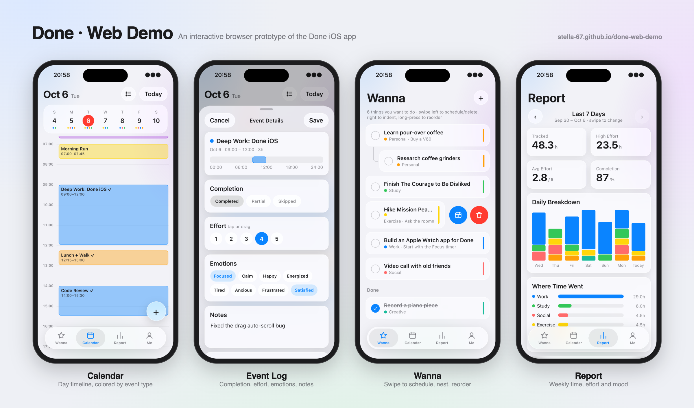

# Done · Web Demo

A single-file, interactive web demo of the Done iOS app (calendar timeline, Wanna list, weekly report).
Mock data only — nothing is stored; refresh to reset.

**Website: https://stella-67.github.io/done-web-demo/** (walkthrough video) · **Try it: https://stella-67.github.io/done-web-demo/app.html**

The demo itself is the single file `app.html` — open it locally in any browser. `index.html` is the landing page.

## Gestures

**Calendar**
- Tap an event → detail / log
- Drag an event → move (15-min snap); drag its top/bottom handle → resize
- Long-press an event 1s (or right-click) → quick menu
- Hold at the left/right edge while dragging → move across days; near top/bottom → auto-scroll
- Drag on empty space → create an event (sticks to neighbouring event edges)
- Swipe left/right, trackpad swipe, or ← → → change day
- Pinch / ⌘ + scroll / trackpad pinch → zoom the timeline
- Pull down at the top → reminders panel
- Long-press the date title → jump to now; tap → date picker

**Wanna** — swipe left: schedule / delete · swipe right: indent · long-press + drag: reorder

**Report** — swipe left/right to change week

On touch devices, dragging events / creating requires a long-press first (0.35s / 0.5s), matching the app.
